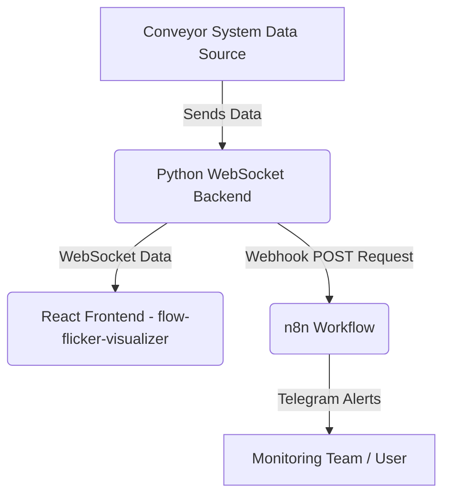

# ซอร์สโค้ดนี้ ใช้สำหรับเป็นตัวอย่างเท่านั้น ถ้านำไปใช้งานจริง ผู้ใช้ต้องจัดการเรื่องความปลอดภัย และ ประสิทธิภาพด้วยตัวเอง

# Smart Conveyor Monitor

This project provides a comprehensive solution for monitoring a conveyor system, visualizing its operational data, and sending real-time alerts based on performance metrics. It integrates a Python WebSocket backend, a React-based frontend for visualization, and an n8n workflow for automated notifications.

---

## System Architecture

The Smart Conveyor Monitor system consists of three main components:

1.  **Python WebSocket Backend (`backend/main.py`)**: Acts as a central hub, receiving real-time conveyor data (e.g., `currentRate`, `totalProduced`) via WebSocket. It processes this data and, based on predefined conditions, triggers webhooks to the n8n workflow.
```bash
https://github.com/warathepj/n8n-smart-conveyor-monitor-backend.git
```
2.  **React Frontend (`flow-flicker-visualizer/`)**: A web application that connects to the Python backend's WebSocket to receive and visualize the conveyor's operational data. It provides a user-friendly interface to monitor the conveyor's status.
```bash
https://github.com/warathepj/flow-flicker-visualizer.git
```
3.  **n8n Workflow**: Receives status updates from the Python backend via webhooks and sends automated alerts to a Telegram chat based on the conveyor's performance (e.g., "too slow", "too fast", "stopped").



---

## Backend: Python WebSocket Server (`backend/main.py`)

This Python script sets up a WebSocket server to receive real-time data from the conveyor system. It processes the `currentRate` of production and sends alerts to the n8n workflow via HTTP webhooks if certain conditions are met.

### Functionality

*   **WebSocket Server**: Listens for incoming WebSocket connections on `ws://localhost:8765`.
*   **Data Reception**: Expects JSON messages containing `currentRate` (pieces per minute) and `totalProduced` units.
*   **Conditional Webhooks**: Based on the `currentRate`, it sends a POST request to the n8n webhook endpoint (`http://localhost:5678/webhook/your-webhook-endpoint`) with a specific status:
    *   `currentRate == 0`: Sends `{"status": "stop", "rate": 0, "totalProduced": <value>}`.
    *   `10 <= currentRate <= 50`: Sends `{"status": "too slow", "rate": <value>, "totalProduced": <value>}`.
    *   `currentRate > 60`: Sends `{"status": "too fast", "rate": <value>, "totalProduced": <value>}`.
*   **Delay**: After sending a webhook, there is a 20-second delay to prevent excessive alerts.

### Setup

1.  **Prerequisites**:
    *   Python 3.7+
    *   `websockets` library
    *   `httpx` library
2.  **Installation**:
    ```bash
    pip install websockets httpx
    ```
3.  **Run the Backend**:
    ```bash
    python main.py
    ```
    The server will start on `ws://localhost:8765`.

---

## Frontend: Flow Flicker Visualizer (`flow-flicker-visualizer/`)

This is a React-based web application designed to visualize the real-time data from the conveyor system. It connects to the Python WebSocket backend to display metrics and status updates.

### Technologies Used

*   **Vite**: Fast build tool for modern web projects.
*   **TypeScript**: Strongly typed JavaScript.
*   **React**: JavaScript library for building user interfaces.
*   **shadcn-ui**: Reusable UI components built with Radix UI and Tailwind CSS.
*   **Tailwind CSS**: A utility-first CSS framework for rapidly building custom designs.
*   **Recharts**: A composable charting library built on React components.
*   **React Router DOM**: For declarative routing in React applications.
*   **Embla Carousel React**: A carousel library.

### Setup

1.  **Prerequisites**:
    *   Node.js (LTS version recommended)
    *   npm or Yarn
2.  **Navigate to Frontend Directory**:
    ```bash
    cd flow-flicker-visualizer/
    ```
3.  **Install Dependencies**:
    ```bash
    npm install
    # or
    # yarn install
    ```
4.  **Run the Frontend**:
    ```bash
    npm run dev
    # or
    # yarn dev
    ```
    The application will typically run on `http://localhost:5173` (or another available port).

---

## n8n Workflow: Smart Conveyor Monitor

This n8n workflow is responsible for receiving status updates from the Python backend and sending Telegram notifications.

### Features

*   **Real-time Monitoring**: Continuously monitors the conveyor's status (speed and total production) via webhooks.
*   **Automated Alerts**: Sends instant notifications to a designated Telegram chat for critical events.
*   **Performance Tracking**: Provides details on the production rate and total units produced in each alert.
*   **Easy Integration**: Utilizes webhooks for seamless data ingress from your Python backend.

### How It Works

1.  **Webhook Trigger**: The workflow is activated by an incoming **POST** request to a specific webhook URL (`your-webhook-endpoint`). This request is expected to contain a JSON payload with the conveyor's `status`, `rate` (pieces per minute), and `totalProduced` units.

    **Example JSON Payload (sent by Python backend):**
    ```json
    {
      "status": "too slow",
      "rate": 10,
      "totalProduced": 500
    }
    ```

2.  **Status Evaluation (Switch Node)**: The received `status` from the webhook payload is then evaluated by a **Switch** node. This node has three defined rules to categorize the conveyor's state:
    *   `too slow`: If the `status` is "too slow".
    *   `too fast`: If the `status` is "too fast".
    *   `stop`: If the `status` is "stop".

3.  **Telegram Notifications**: Depending on the evaluated status, a corresponding Telegram message is sent to the configured chat ID (`your-chat-id`):
    *   **"Too Slow"**: Sends a message indicating "อัตราการผลิต ช้าเกินไป" (Production rate too slow) along with the current `rate` and `totalProduced` count.
    *   **"Too Fast"**: Sends a message indicating "อัตราการผลิต เร็วเกินไป" (Production rate too fast) along with the current `rate` and `totalProduced` count.
    *   **"Stop"**: Sends a critical alert "ไลน์ผลิตหยุด!!!!" (Production line stopped!!!!) along with the `totalProduced` count.

### n8n Workflow Setup

To use this workflow, you'll need an n8n instance and a Telegram Bot API token.

#### Prerequisites

*   An active n8n instance.
*   A Telegram account and a Telegram bot created via BotFather. (You'll need the **HTTP API Token** for your bot.)
*   The **Chat ID** of the Telegram chat where you want to receive notifications. You can get this by forwarding a message from the desired chat to the userinfobot on Telegram.

#### Node Configuration

1.  **Webhook Node**: This node is already configured with a unique path. You will use this URL to send data from your conveyor monitoring system.
2.  **Telegram Nodes (Telegram, Telegram1, Telegram2)**:
    *   For each **Telegram** node, click on the **Credentials** section.
    *   Click "Create New" for the "Telegram account" credential.
    *   Enter your Telegram Bot's **HTTP API Token** (obtained from BotFather).
    *   Ensure the **Chat ID** for all Telegram nodes is set to `your-chat-id`, or update it to your desired chat ID.

---

## Usage
1.  **Start the n8n workflow**: Ensure your n8n instance is running and the "Smart Conveyor Monitor" workflow is active.
2.  **Start the Python backend**: Run `python main.py`. This will start the WebSocket server.
3.  **Start the React frontend**: Navigate to `flow-flicker-visualizer/` and run `npm run dev`. This will launch the visualization application.
4.  **Simulate Conveyor Data**: The React frontend (specifically `ConveyorSimulator.tsx` and `useConveyorLogic.ts`) is designed to simulate conveyor data and send it to the Python WebSocket backend.
5.  **Monitor Alerts**: Observe the Telegram chat for automated alerts based on the simulated conveyor performance.
